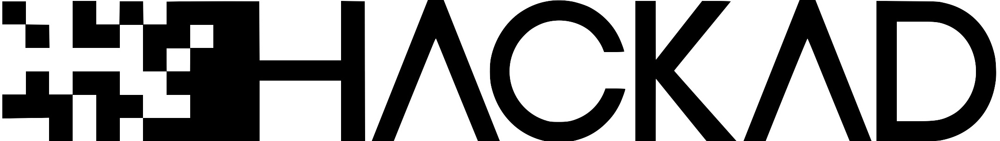
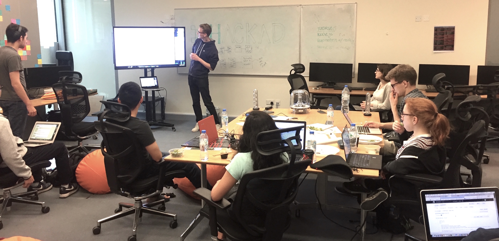

<!-- [HackAD Logo](hackad-logo.jpg?resize=700,100) {.pull-left} -->
 {.title-logo}
---

<h5>A student organization run of Unix Lab with the mission to promote technology at NYUAD and in the UAE </h5>

HackAD is a student group at NYU Abu Dhabi devoted to creating social space for discussion and pursuit of technology. The group meets every week to work on projects and discuss new ideas over pizza or tasty Mana’eesh (popular levantine pastry). Members of HackAD mainly focus on creating software (e.g. NYU Vote - campus wide voting system) and electronics (e.g. Raspberry Pi hackery).

##Celebrating technology in inclusive ways

HackAD focuses on cutting edge tech, while addressing new topics and attracting a greater diversity of members. We want to create a comfortable environment for people from majors other than Computer Science and Electrical Engineering to explore technology. Together with Women in STEM group at NYU Abu Dhabi, we focus on making technology accessible and open, much in the spirit of the purpose the internet originally served.

##HackNYU 2017 | Abu Dhabi Branch

For the first time, HackAD brought HackNYU from the Brooklyn and Washington Square campus into Abu Dhabi. Across the NYU network, we had 81 project submissions and 400+ participants. With a two week notice, our Abu Dhabi team put together 36 hours of swag, food, workshops and hackery.

 {.center-img}

In a true hacker way, we decided to create our own swag - stickers, t-shirts and hoodies. We designed the graphics (learning that small things are really hard to print but look great!) and screen printed on some 50 pieces of textile (front and back).

 {.pull-left .side-by-side}
 {.pull-right .side-by-side}

*Writen by Martin Slosarik*
